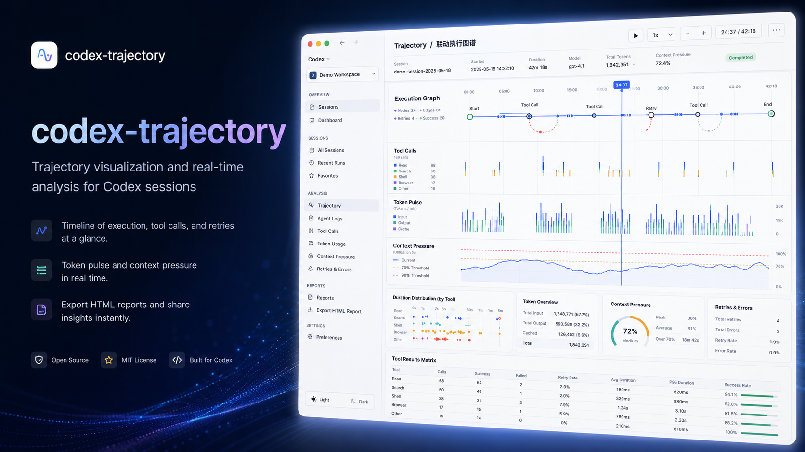

# Codex Trajectory



Codex Desktop 的本机只读轨迹抽屉。它从本机 Codex 会话日志构建任务执行轨迹，并通过仅限本机的 CDP 页面注入显示。不会修改 `ChatGPT.app`、app.asar、签名、模型配置或 API Key。

## 功能

- 在 Codex 页面提供直达“实时分析 V2”的轨迹按钮。
- 按当前 `/thread/<UUID>` 精确绑定主任务；可只读汇总关联子代理的 Token、工具调用、失败和并行活跃时间。
- V2 页面展示执行时间图谱、工具矩阵、耗时分布、失败重试链和 Agent 关系图。
- 可导出不依赖网络的 HTML 执行报告。

## 前提条件

- macOS；脚本使用 macOS 的 `open`、`dscl` 和 `.command` 文件。
- 已安装 Codex Desktop（当前脚本从 `/Applications/ChatGPT.app` 启动）。
- Node.js 20 或更高版本。检查方法：

```sh
node --version
```

本项目没有 npm 依赖；不需要执行 `npm install` 或 `npm ci`。

## 首次安装

```sh
git clone https://github.com/minipopstyle/codex-trajectory.git
cd codex-trajectory
npm run check
./scripts/install.sh
```

安装会将运行所需文件复制到 `~/.codex/codex-trajectory`，不会修改原始仓库或 Codex 应用。

## 启动、停止与更新

### 启动

在 Finder 中双击：

```text
~/.codex/codex-trajectory/scripts/重启.command
```

或在终端执行：

```sh
~/.codex/codex-trajectory/scripts/start.sh
```

启动脚本会在需要时以 `127.0.0.1:9341` 开启 Codex 的远程调试接口，然后在后台启动轨迹宿主进程。终端窗口关闭后，轨迹宿主仍会继续运行。

若 Codex 已打开，macOS 的单实例机制可能忽略远程调试参数。此时完全退出 Codex，再重新执行启动脚本即可。

### 状态与停止

```sh
~/.codex/codex-trajectory/scripts/status.sh
~/.codex/codex-trajectory/scripts/stop.sh
```

也可以在 Finder 双击 `~/.codex/codex-trajectory/scripts/停止.command`。停止脚本只停止轨迹宿主和移除其页面 DOM；不会关闭 Codex，也不会停止其他皮肤或插件。

### 更新已克隆的仓库

```sh
cd ~/codex-trajectory && git pull --ff-only && npm run check && ./scripts/install.sh
```

然后重新运行 `重启.command` 或 `start.sh`。如果克隆时使用了不同目录，请将 `~/codex-trajectory` 换成实际路径。

## 使用方式

1. 启动 Codex Trajectory 后，打开或刷新 Codex Desktop。
2. 进入一个已有任务。Codex 左侧栏顶部附近会出现一个带波形线条的方形图标（见下方说明）。这是入口按钮，它默认不显示“实时分析”文字。
3. 点击这个波形图标，打开“Trajectory V2 · 实时分析”抽屉，查看时间图谱、工具矩阵、耗时分布、失败恢复和 Agent 关系图。
4. 在 V2 页面选择“生成执行报告”可下载离线 HTML。

按钮只是一个波形图标，不是菜单按钮；点击后会直接打开 V2，不会出现旧版轨迹或 Trace 对比选项。抽屉默认关闭，支持 Esc 和关闭按钮。

## 数据边界

- 只读 `~/.codex/sessions/**/rollout-*.jsonl`，按当前 URL `/thread/<UUID>` 精确绑定主任务。
- 轨迹默认只展示主任务；指标区会只读递归关联的 `source.subagent` 文件，用于汇总 Token、工具、失败和并行活跃时间。找不到本机 child 文件时仍展示主任务，并标出子代理覆盖率。
- 文件首次完整解析，之后按字节增量读取；源日志永不修改、不复制、不上传。
- V2 报告会导出当前可解码的完整文本工具原文；请勿把包含敏感内容的报告分享给无权限的人。

CDP 只绑定在回环地址 `127.0.0.1`，但具有本机页面调试权限；仅应在受信任的本机用户环境中启用。若要关闭 Codex 的 CDP 接口，请完全退出 Codex，再以正常方式重新打开。

## 故障排查

**启动提示 Codex 已在运行且未开放 9341**

完全退出 Codex（而不只是关闭窗口），然后重新运行 `start.sh` 或 `重启.command`。

**波形图标按钮没有出现**

运行 `status.sh` 确认显示“运行中”和“Codex CDP: 9341 已开放”，然后刷新 Codex 页面。仍没有按钮时，完全退出 Codex，再运行 `重启.command`；按钮位于 Codex 左侧栏顶部附近。Codex 升级后若改变路由、CDP target 或 rollout 字段，可能需要更新适配器。

**导出的报告可否直接分享？**

不建议直接分享。报告可能包含可解码的完整工具输入与输出；请先检查并移除不应披露的内容。

## 验证

```sh
./scripts/verify.sh
```

V2 的底层判定逻辑来源详见 `THIRD_PARTY_NOTICES.md`。
